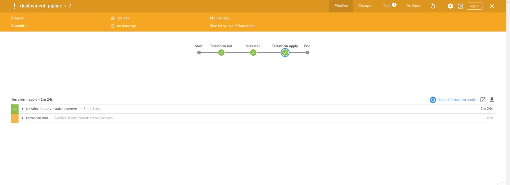

# Jenkins Deployment Pipeline with Terraform
This repository provides a Jenkins pipeline for deploying infrastructure with Terraform. It supports seamless updates, customizable deployment parameters, flexible network configurations, and adaptable initialization scripts to fit various deployment scenarios.

## Key Components

### Jenkins
- *Terraform Scanning*: Utilizes Terrascan to check Terraform code for security and compliance issues, generating an XML report for JUnit to display.
- *GitHub Integration*: Uses a parameter to fetch release pages from a specified GitHub repository, which has its own GitHub Actions CI pipeline.

### Terraform
- *Release Management*: Retrieves the release URL provided by Jenkins.
- *State Management*: Stores the statefile in an S3 backend and uses DynamoDB for state locking.
- *Autoscaling Group*: Sets up an autoscaling group with a template that includes an initialization bash script to install the artifact.
- *Network Configuration*: Allows the creation of subnets based on user-defined variables.

## Prerequisites

This project uses the followint tools:
- *Jenkins*
- *Terraform*
- *AWS*
- *Terrascan*

## Setup Instructions

### Jenkins Setup
1. *Required tools*: I installed the following tools on an amazon linux ec2-instance for Jenkins:
   - Git
   - Terraform
   - Terrascan
2. *Configure Jenkins Job*:
   - I Created a new pipeline job.
   - Then added parameters for the GitHub releases repository.
   - Finally Set up the relevant credentials / secrets for the build process.

### Terraform Configuration
1. *Backend Configuration*:
   - I Configure a seperate terrafom build for the S3 and dynamodb backend to store the statefile.
2. *Variable Definitions*:
   - I defined variables for the used vpc, internet gateway, subnet cidr array and the github release / artifact url in vars.tf.
3. *Init Script*:
   - I made the initialization bash script to for the specific deployment. It can be modified to accomodate any other deployment.

## Usage

1. *Triggering the Pipeline*:
   - Start the Jenkins job with the appropriate parameters.
   - Monitor the progress through the Jenkins interface, then the aws web console.
   - If you're updating the deployment, watch as it uses rolling release strategy to create new ec2 instances with the updated deployment before deleting the old deployment.
2. *Monitoring*:
   - Check the JUnit report for detailed scan results.
   - Verify the Terraform deployment logs for any issues.
   - Check the newly created ec2-instances on aws web console

## Customization

- *Initialization Script*: The init script (init.sh) can be modified to handle different artifacts or installation steps.

bash script to install pm2 and start a nodejs web app.

```
#!/bin/bash
sudo yum install -y wget
sudo yum install -y nodejs
sudo npm install pm2@latest -g
sudo pm2 startup
cd ~/
sudo touch test.txt
# terraform template variable, that's acquired from jenkins release url
wget  ${release_archive}
sudo tar xf dist.tar.gz
cd ~/dist/
npm install 
sudo PORT=80 pm2 start "node main.js"
```

- *Terraform Variables*: Modify the variables in vars.tf to customize the subnets.
- *Jenkins Pipeline*: Can be Modified to add or modify steps as per your workflow.

 
 
